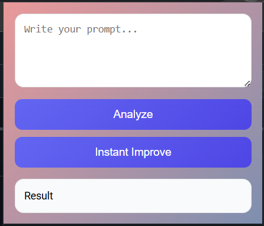
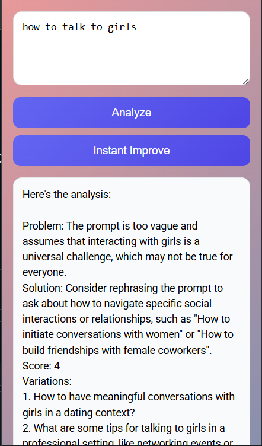
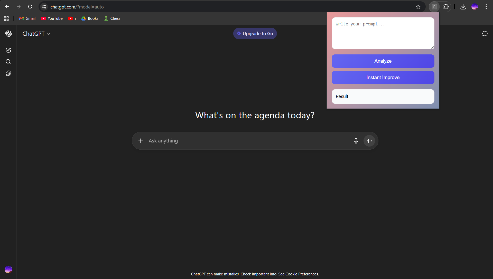

# Promtly
> *Optimize your prompts instantly before sending them to AI models*  

<p align="center">
  
  
  
</p>

---

## Overview  
**Promtly** is a Chrome Extension that you could use when you're typing a prompt in ChatGPT, Gemini, or other AI tools — and offers you smart optimizations to make your prompts clearer, more effective, and powerful.  

It’s like having a **built-in prompt engineer, who also tells you whats wrong with your prompt** inside your browser.  

---

## Features  
- 🔍 **Integrated in the Workflow** – You dont have to take much efforts to improve your prompt.  
- ⚡ **One-Click Optimization** – Instantly improve prompts with a simple click or shortcut.  
- 🎯 **Learning** – Tells the user exactly where the prompt can be improved and why.  
- 🎨 **Seamless UI** – Minimal, distraction-free popup for effortless use.  
- 🔒 **Analyse and Instant** – two different options to meet your productivity needs.

---

## Screenshots  
<p align="center">
  
  
  
</p>

---

## 🛠 Installation  

### From Source (Developer Mode)  
1. Clone this repository  
   ```bash
   git clone https://github.com/spunkyhacker/promtly.git
   ```  
2. Download **Ollama** from their offical Website (to run the local ai model powering the extension)
3. Dolwnlod the Ai Model from ollama 
   ```bash
   ollma pull llama3.1:8b
4. Open **chrome://extensions/** in Chrome  
5. Enable **Developer Mode** (top right)  
6. Click **Load unpacked** and select the extension folder  
---

### Note:
This is a temporary solution. In the future you will not be required to download the model.

---

## Usage  
1. Open ChatGPT, Gemini, or another AI chat tool.  
2. Type your prompt normally.  
3. Select your text and use **Ctrl+Shift+Y** shortcut to give you instant prompt upgrade, Analyse if you wish.  

---

## Tech Stack

### Core Extension
1. *Manifest V3* – Chrome’s latest extension architecture (secure, service-worker-based).
2. *JavaScript (Vanilla or ES6+)* – For handling content scripts, DOM detection, and logic.
3. *HTML5 + CSS3* – For the popup UI and options page.

### UI / Styling
1. CSS – For a modern, responsive popup design.

### AI Optimization Logic
1. Local Hosted Ai (Right-Now) – Right Now using llama3.1:8b hosted locally
2. External AI API (optional) – Working on to use more lighter and fine tuned ai which is hosted on a server.

### Future Development
Converting the use of locally operated Ai model to a much more light weight model which would run on a server.


## Inspiration  
This extension was inspired by the need for **better prompts** in AI chat platforms.  
Instead of wasting time rewriting prompts, *Promtly* makes your ideas sharper and more effective instantly.  
It reduces the use of using Heavy Ai carelessly.

---

<p align="center"> 
  Made with ❤️ by <a href="https://github.com/spunkyhacker">Tharun Prasath</a>  
   | <a href="https://github.com/arc5tar">Shivansh Verma</a>
   | <a href="#">Sandeev</a>
   | <a href="#">Anu Shree</a>
    
</p>
